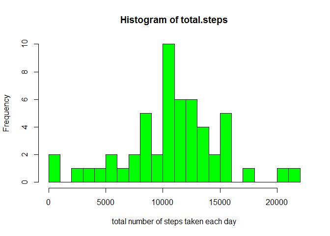
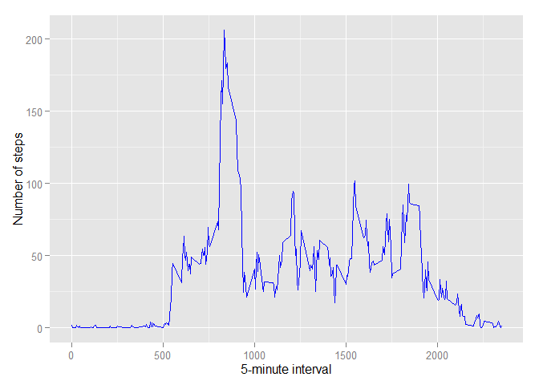
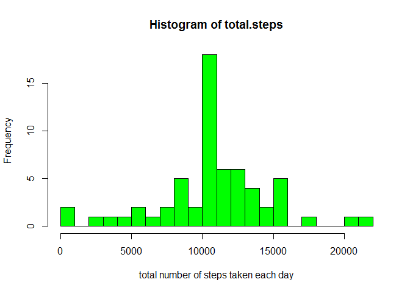
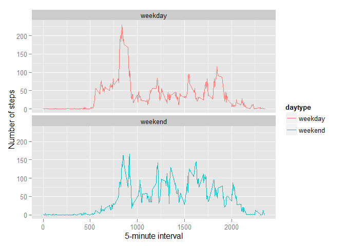

# Reproducible Research: Peer Assessment 1

--------------------

## Loading and pre-processing the data
  
Load data.

```r
# Load data
unzip(zipfile="activity.zip")
data <- read.csv("activity.csv")
```

Pre-process data: Change to "Date" type for the "date" variable for later use.

```r
# Pre-process data
data$date <- as.Date(data$date)
```

--------------------

## What is mean total number of steps taken per day?  

Calculate the total number of steps taken per day.

```r
# Remove NAs
data.rmna <- subset(data, !is.na(data$steps))
# Total number of steps taken per day
total.steps <- tapply(data.rmna$steps, data.rmna$date, FUN=sum, na.rm=TRUE)
```
  
Make a histogram of the total number of steps taken per day.

```r
# Histogram
hist(total.steps, col="green", breaks=20, xlab="total number of steps taken each day")
```

 
  
Calculate and report the mean and median total number of steps taken per day.

```r
mean(total.steps)
```

```
## [1] 10766.19
```

```r
median(total.steps)
```

```
## [1] 10765
```

--------------------

## What is the average daily activity pattern?
    
Calculate the average daily activity pattern.

```r
# Average daily activity pattern
averages <- aggregate(x=list(steps=data.rmna$steps), by=list(interval=data.rmna$interval), FUN=mean, na.rm=TRUE)
```
  
Make a time series plot of the 5-minute interval (x-axis) and the average number of steps taken, averaged across all days (y-axis).

```r
library(ggplot2)
# Time series plot
ggplot(averages, aes(x=interval, y=steps)) + geom_line(color = "blue") + labs(x="5-minute interval", y="Number of steps")
```

 
  
Get the 5-minute interval, on average across all the days in the dataset, contains the maximum number of steps.

```r
# 5-minute interval contains the maximum number of steps
averages[which.max(averages$steps), "interval"]
```

```
## [1] 835
```

--------------------

## Imputing missing values
  
Note that there are a number of days/intervals where there are missing values (coded as NA). The presence of missing days may introduce bias into some calculations or summaries of the data.
  
Calculate and report the total number of missing values in the dataset.  

```r
# Total number of missing values
sum(is.na(data$steps))
```

```
## [1] 2304
```
  
Strategy for filling in the missing values: Replace each missing value with the mean value of its 5-minute interval.
  
Create a new dataset that is equal to the original dataset but with the missing data filled in.  

```r
# Function: to fill NAs
fill.na <- function(steps, interval) {ifelse (is.na(steps), averages[averages$interval==interval, "steps"], c(steps))}
# New dataset with missing data filled in
newdata <- data
newdata$steps <- mapply(fill.na, newdata$steps, newdata$interval)
```
  
Calculate the total number of steps taken per day.

```r
# Total number of steps taken per day
total.steps <- tapply(newdata$steps, newdata$date, FUN=sum)
```
  
Make a histogram of the total number of steps taken each day.

```r
# Histogram
hist(total.steps, col="green", breaks=20, xlab="total number of steps taken each day")
```

 
  
Calculate and report the mean and median total number of steps taken per day.

```r
mean(total.steps)
```

```
## [1] 10766.19
```

```r
median(total.steps)
```

```
## [1] 10766.19
```

Do these values differ from the estimates from the first part of the assignment?   
The mean value of the origin data is 10766.19.  The mean value of the filled-in data is also 10766.19.  They are the same because the missing data are imputed with mean values.  The median value of the origin data is 10765.  The median value of the filled-in data is 10766.19, equals to the mean.  So, there's a small change between the original and new median values.  This is because when more mean values filled in, the distribution concentrates close to the mean, the histogram becomes more symmetrical, more gaussian, so the mid point (median) shifts close and equals to the mean.  

What is the impact of imputing missing data on the estimates of the total daily number of steps?  
The impact of imputing missing data is that: we have more data and the data distribution is more symmetrical, more gaussian, so results in less bias.

--------------------

## Are there differences in activity patterns between weekdays and weekends?
  
Create a new factor variable in the new dataset with two levels - "weekday" and "weekend" indicating whether a given date is a weekday or weekend day.

```r
# Function: to tell if a date is a weekday or weekend day
dtype <- function(d) {ifelse (weekdays(d) %in% c("Saturday", "Sunday"), "weekend", "weekday")}
# New factor variable
daytype <- sapply(newdata$date, dtype)
newdata$daytype <- as.factor(daytype)
```

Make a panel plot containing a time series plot of the 5-minute interval (x-axis) and the average number of steps taken, averaged across all weekday days or weekend days (y-axis).

```r
# Averages
averages <- aggregate(steps ~ interval + daytype, data=newdata, FUN=mean)
# Time series plot
ggplot(averages, aes(x=interval, y=steps, color = daytype)) + 
       geom_line() + facet_wrap(~daytype, ncol = 1, nrow=2) + 
       labs(x="5-minute interval", y="Number of steps")      
```

 

From the plot we can see that: over all, there are more activity on the weekends than on the weekdays.
